# bootstrap_components
some usage of bootstrap &amp; components<br>


### 按钮样式
需要注意的是  不管是哪种按钮样式 都必须先加上 btn 这个类名 <br>

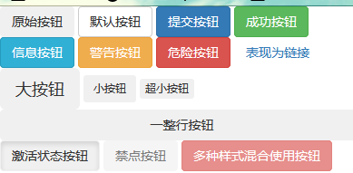 <br>


### 表格样式
同样必须先加上table这个类名，<br>
需要注意的是需要使表格某行出现激活状态或者其他状态 需要在该行的tr上添加active 类名（或其他相应的状态类名） ，而不是在表格上添加.<br>


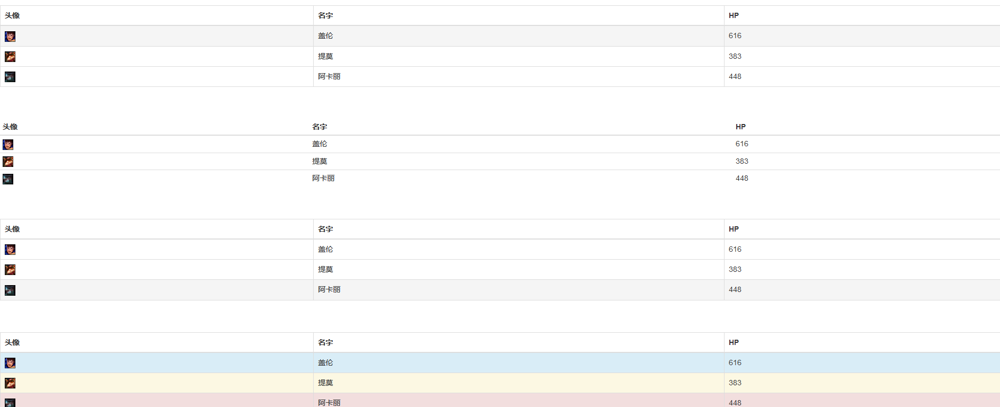 <br>


### 表单
为表单元素添加 form-control类名 可以去除阴影 focus状态有蓝色边框 看起来更柔和<br>


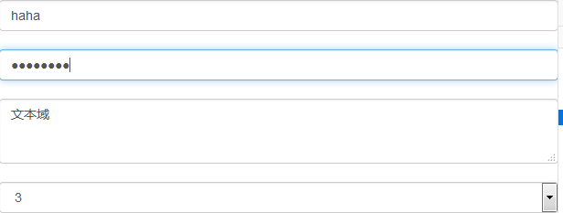 <br>


### 文本
文本部分代码略过<br>
text-muted text-primary text-success text-info text-warning text-danger


### 背景
bg-danger  bg-info bg-success bg-warning

### 其他
#### 关闭按钮
tips：&times 代表 x 
#### 小三角 
caret
#### 左浮动 右浮动
pull-left pull-right
#### 显示 隐藏
show hidden

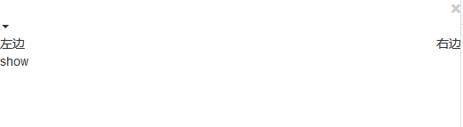 <br>


### 字体图标
第一步添加glyphicon <br>
第二步 找到想要的字体图标的class名  <br>
更多图标 [请戳](http://v3.bootcss.com/components/)<br>
如果想给字体图标加上超链接 只需在外面嵌套一层a标签 例如<a><span class="glyphicon glyphicon-alert"></span>链接</a>   <br>
如果想在button上显示字体图标 例如 <br>
```
<button type="button" class="btn btn-primary">
    <span class="glyphicon glyphicon-adjust"></span>按钮
</button>
```
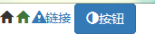 <br>


### 下拉菜单
tips： role属性是为了增强语义化 <br>

第一步最外层的div添加dropdown样式 <br>
第二步button添加dropdown-toggle样式 设置id  并且添加data-toggle="dropdown" <br>
第三步 给选项的ul添加dropdown-menu样式 并且添加aria-labelledby="刚才设置的id" <br>

####  如果想给选项添加一个不可点击的标题项 
可以添加        <li class="dropdown-header">标题</li>  <br>

#### 如果想在选项中添加分割线 
可以添加         <li class="divider"></li>   <br>

#### 如果某个选项禁选
直接在li添加disabled类名
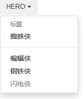 <br>


### 按钮组
给最外层的div添加btn-group即可  <br>
按钮工具栏添加 btn-toolbar <br>
调节按钮组的大小  btn-group-lg/xs/sm  <br>

#### 如果想变成垂直排列
添加 btn-group-vertical 

#### 如果想用按钮组实现复选框
第一步 在最外层div额外添加一个data-toggle="buttons"
第二步     
```
<label class="btn btn-primary active">
        <input type="checkbox" checked> wow
</label>

```
单选框同理 唯一需要修改的是type="radio"

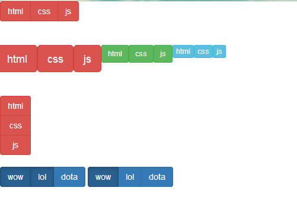 <br>


### 按钮式下拉菜单
和之前的下拉菜单大同小异
#### 分裂式下拉菜单
只是在原有的button元素下 新增一个button元素  <br>
```
<button type="button" class="btn btn-default">默认</button>
    <button type="button" class="btn btn-default dropdown-toggle" data-toggle="dropdown">
        <span class="caret"></span>
    </button>
```
#### 实现往上弹出选项
在最外层的div添加dropup 


### 输入框组
第一步 最外层div添加 input-group类名<br>
第二步 给子元素span添加 input-group-addon 且添加id <br>
第三部 给子元素input添加 form-control类名 并且aria-describedby="id"

#### 整合式输入组框
```
div class="input-group">
    <div class="input-group-btn">
        <button type="button" class="btn btn-default dropdown-toggle" data-toggle="dropdown">
            搜索
            <span class="caret"></span>
        </button>
        <ul class="dropdown-menu">
            <li><a href="#">Google</a></li>
            <li><a href="#">百度</a></li>
            <li><a href="#">搜狗</a></li>
            <li class="divider"></li>
            <li><a href="#">人民搜索</a></li>
        </ul>
    </div>
    <input type="text" class="form-control" placeholder="输入搜索内容">
</div>
```
主要区别在于添加了一个<div class="input-group-btn"> <br>

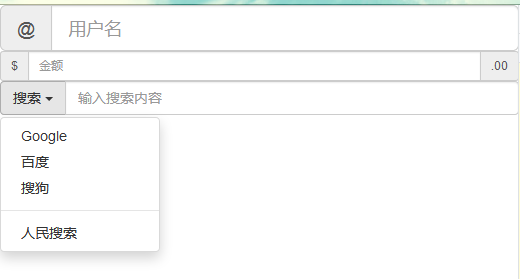 <br>


### 导航栏
第一步 给最外层的ul添加 nav nav-tabs两个类名 <br>
胶囊式标签页 改为nav-pills,顺带一提 如果 想改为垂直胶囊式 在nav-pills基础上 还要额外增加一个nav-stacked 类名<br>
面包屑导航 直接添加一个类名 breadcrumb <br>
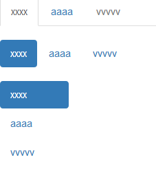 <br>


### 分页
给ul添加 pagination 类名
#### 翻页样式
只用添加 pager类名 <br>
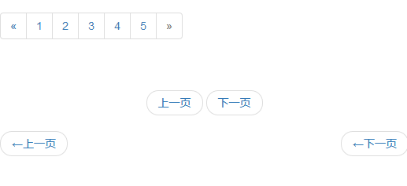 <br>


### 标签
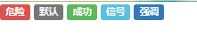 <br>


### 徽章
badge
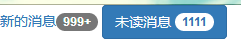 <br>

### 缩略图
从缩略图中进一步了解text-algin：center 控制文本居中，原先误解为只对行内元素生效，其实对甚至块级元素的文本也有居中的效果<br>


### 警告框
.alert .alert-info....


### 进度条
.progress 
#### 如果想实现多个进度混在一个进度条里
```
<!--堆叠在一起-->
<div class="progress">
    <div class="progress-bar progress-bar-striped" style="width: 20%">条纹</div>
    <div class="progress-bar progress-bar-info" style="width: 60%">60%</div>
    <div class="progress-bar progress-bar-danger" style="width: 20%">20%</div>
</div>


```
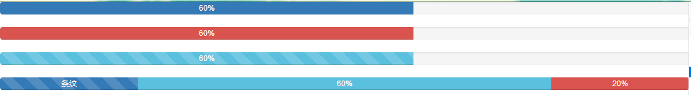 <br>

### 列表组
父元素.list-group  子元素.list-group-itme

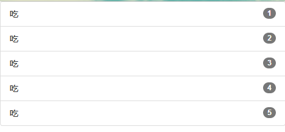 <br>


### 面板
父元素.panel  面板内容.panel-body 面板脚注.panel-footer<br>


### 顶部底部
顶部固定 下拉不消失 .navbar navbar-default navbar-fixed-top <br>
顶部固定 下拉消失  .navbar-static-top <br>
底部固定 下拉不消失 .navbar navbar-default navbar-fixed-bottom<br>

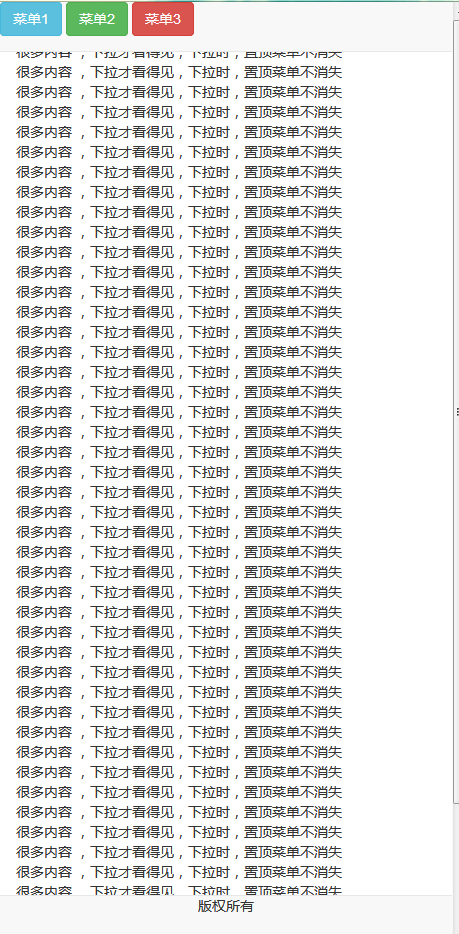 <br>


### 模态窗
需要注意的：<br>
第一点 button 按钮的data-toggle="modal" data-target="#id"<br>
第二点 总体结构modal > modal-dialog> modal-content >modal-header + modal-body + modal-footer <br>
第三点 关闭按钮一定要添加 data-dismiss="modal" 才能实现点击后关闭模态窗 <br>
第四点 控制淡入淡出效果 需要在父元素添加 fade类名 <br>
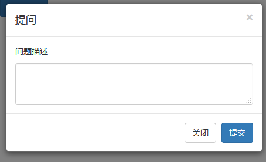 <br>

### 可切换导航
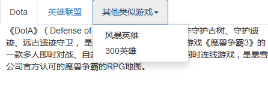 <br>

### 鼠标悬停提示信息
值得注意的是<br>
第一点：data-toggle="tooltip" <br>
第二点: data-placement="right/left/top/bottom" 控制提示信息显示的方向 <br>
第三点：title="xxx"  title中的内容为提示的内容

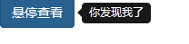 <br>


